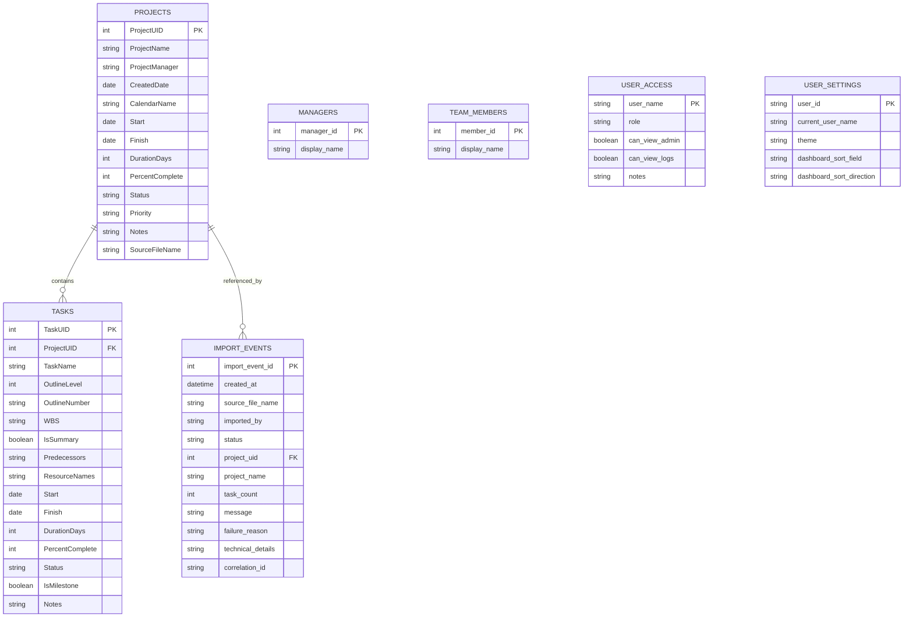

# Database Schema

This document summarizes the live PostgreSQL schema currently used by the application and highlights where the database shape differs from SQLAlchemy model expectations.

Generated from the local `project_tracker` database on `2026-03-31`.

## Tables

### `projects`

Primary key:
- `ProjectUID`

Columns:
- `ProjectUID` `INTEGER NOT NULL DEFAULT nextval('projects_ProjectUID_seq')`
- `ProjectName` `VARCHAR(255) NOT NULL`
- `ProjectManager` `VARCHAR(150) NOT NULL`
- `CreatedDate` `DATE NOT NULL`
- `CalendarName` `VARCHAR(150) NOT NULL`
- `Start` `DATE NOT NULL`
- `Finish` `DATE NOT NULL`
- `DurationDays` `INTEGER NOT NULL`
- `PercentComplete` `INTEGER NOT NULL`
- `Status` `VARCHAR(50) NOT NULL`
- `Priority` `VARCHAR(30) NOT NULL`
- `Notes` `TEXT NOT NULL`
- `SourceFileName` `VARCHAR(255) NOT NULL`

Indexes:
- `ix_projects_ProjectUID (ProjectUID)`

### `tasks`

Primary key:
- `TaskUID`

Foreign keys:
- `ProjectUID -> projects(ProjectUID)`

Columns:
- `TaskUID` `INTEGER NOT NULL DEFAULT nextval('tasks_TaskUID_seq')`
- `ProjectUID` `INTEGER NOT NULL`
- `TaskName` `VARCHAR(255) NOT NULL`
- `OutlineLevel` `INTEGER NOT NULL`
- `OutlineNumber` `VARCHAR(50) NOT NULL`
- `WBS` `VARCHAR(50) NOT NULL`
- `IsSummary` `BOOLEAN NOT NULL`
- `Predecessors` `TEXT NOT NULL`
- `ResourceNames` `VARCHAR(255) NOT NULL`
- `Start` `DATE NOT NULL`
- `Finish` `DATE NOT NULL`
- `DurationDays` `INTEGER NOT NULL`
- `PercentComplete` `INTEGER NOT NULL`
- `Status` `VARCHAR(50) NOT NULL`
- `IsMilestone` `BOOLEAN NOT NULL`
- `Notes` `TEXT NOT NULL`

Indexes:
- `ix_tasks_TaskUID (TaskUID)`
- `ix_tasks_ProjectUID (ProjectUID)`

### `import_events`

Primary key:
- `import_event_id`

Foreign keys:
- `project_uid -> projects(ProjectUID)`

Columns:
- `import_event_id` `INTEGER NOT NULL DEFAULT nextval('import_events_import_event_id_seq')`
- `created_at` `TIMESTAMP NOT NULL`
- `source_file_name` `VARCHAR(255) NOT NULL`
- `imported_by` `VARCHAR(150) NOT NULL`
- `status` `VARCHAR(20) NOT NULL`
- `project_uid` `INTEGER NULL`
- `project_name` `VARCHAR(255) NOT NULL`
- `task_count` `INTEGER NOT NULL`
- `message` `TEXT NOT NULL`
- `failure_reason` `VARCHAR(255) NOT NULL`
- `technical_details` `TEXT NOT NULL`
- `correlation_id` `VARCHAR(64) NOT NULL DEFAULT ''`

Indexes:
- `ix_import_events_import_event_id (import_event_id)`

### `managers`

Primary key:
- `manager_id`

Columns:
- `manager_id` `INTEGER NOT NULL DEFAULT nextval('managers_manager_id_seq')`
- `display_name` `VARCHAR(150) NOT NULL`

Constraints and indexes:
- unique `display_name`
- `ix_managers_manager_id (manager_id)`
- `managers_display_name_key (display_name)`

### `team_members`

Primary key:
- `member_id`

Columns:
- `member_id` `INTEGER NOT NULL DEFAULT nextval('team_members_member_id_seq')`
- `display_name` `VARCHAR(150) NOT NULL`

Constraints and indexes:
- unique `display_name`
- `ix_team_members_member_id (member_id)`
- `team_members_display_name_key (display_name)`

### `user_access`

Primary key:
- `user_name`

Columns:
- `user_name` `VARCHAR(150) NOT NULL`
- `role` `VARCHAR(50) NOT NULL`
- `can_view_admin` `BOOLEAN NOT NULL`
- `can_view_logs` `BOOLEAN NOT NULL`
- `notes` `TEXT NOT NULL`

### `user_settings`

Primary key:
- `user_id`

Columns:
- `user_id` `VARCHAR(120) NOT NULL`
- `current_user_name` `VARCHAR(150) NOT NULL`
- `theme` `VARCHAR(10) NOT NULL`
- `dashboard_sort_field` `VARCHAR(50) NOT NULL`
- `dashboard_sort_direction` `VARCHAR(10) NOT NULL`

## Mermaid ER Diagram

## Drift Review

### No structural drift found in key entities

The live database matches the current SQLAlchemy model structure for:
- `projects`
- `tasks`
- `import_events`
- `managers`
- `team_members`
- `user_access`
- `user_settings`

That includes:
- sequence-backed integer IDs for `projects`, `tasks`, and `import_events`
- the expected foreign keys from `tasks` and `import_events` to `projects`
- the import diagnostics columns:
  - `failure_reason`
  - `technical_details`
  - `correlation_id`

### Important nuance: model defaults are mostly application-side, not database-side

Several SQLAlchemy models declare defaults such as:
- `Status`
- `Priority`
- `PercentComplete`
- `Notes`
- `current_user_name`
- `theme`

In the live PostgreSQL schema, most of those are **not** server defaults. They are applied by the application layer during inserts.

That means:
- inserts done through this app behave as expected
- direct SQL inserts that omit those values may fail or behave differently

This is not necessarily wrong, but it is worth documenting because it matters for:
- future migrations
- external integrations
- any move toward Foundry or another downstream platform

### Production-readiness notes

If this schema becomes more broadly integrated, the next useful documentation or migration steps would be:
- add Alembic migrations so schema evolution is versioned outside application startup
- decide whether important defaults should move from application defaults to database defaults
- document which tables are operational/audit tables versus core domain tables
